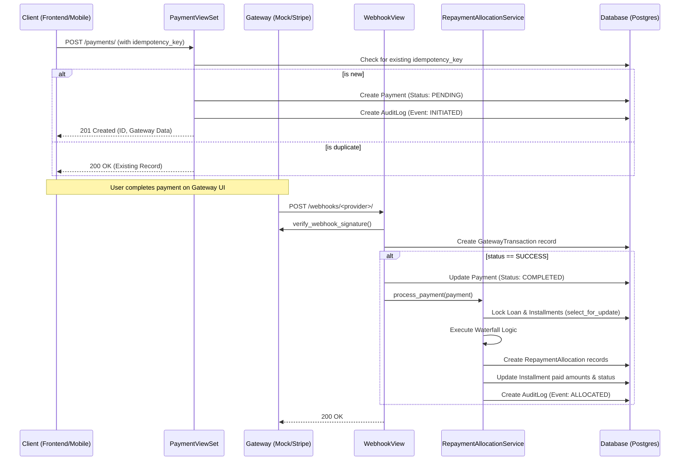

# Technical Workflow: Payment Processing & Allocation

This document describes the internal engineering flow for handling payments within the `payments` app.

## 1. Sequence Overview

The diagram below outlines the standard flow for an external gateway (e.g., Stripe, M-Pesa).



## 2. Key Components

### Idempotency & Initiation

- **Endpoint**: `POST /api/payments/payments/`
- **Logic**: The `PaymentViewSet.create` method is wrapped in `transaction.atomic`. It uses the `idempotency_key` (scopded to the user) to ensure that retries do not create duplicate records.
- **Audit**: Every initiation is logged in `PaymentAuditLog`.

### The Repayment Engine (Waterfall)

When a payment is marked as `COMPLETED`, the `RepaymentAllocationService` follows a strict priority queue for the loan's installments:

1. **Penalties** (Highest Priority)
2. **Interest**
3. **Principal** (Lowest Priority)

If a user pays more than the total currently due, the **Overpayment Rule** applies:

- Excess funds are applied to the principal of the **final installment**, effectively reducing the total debt.

### Concurrency & Selection

To prevent race conditions (e.g., two webhooks arriving at once), the engine uses **Pessimistic Locking**:

```python
payment = Payment.objects.select_for_update().get(pk=payment.pk)
loan = Loan.objects.select_for_update().get(pk=loan.pk)
```

## 3. Audit & Observability

- **PaymentAuditLog**: Records state transitions (`INITIATED` -> `COMPLETED`) and allocation results.
- **PaymentGatewayTransaction**: Stores the raw JSON payload from external providers for debugging purposes.
- **Django Admin**: Provides a unified view of all related records (Audit Logs, Allocations, and Transactions) in a single page.

## 4. Integration Guide for New Gateways

To add a new provider:

1. **Subclass** `BasePaymentGateway`.
2. **Implement** `initiate_payment`, `verify_webhook_signature`, and `handle_webhook_payload`.
3. **Register** the new class in `GatewayFactory._gateways`.
